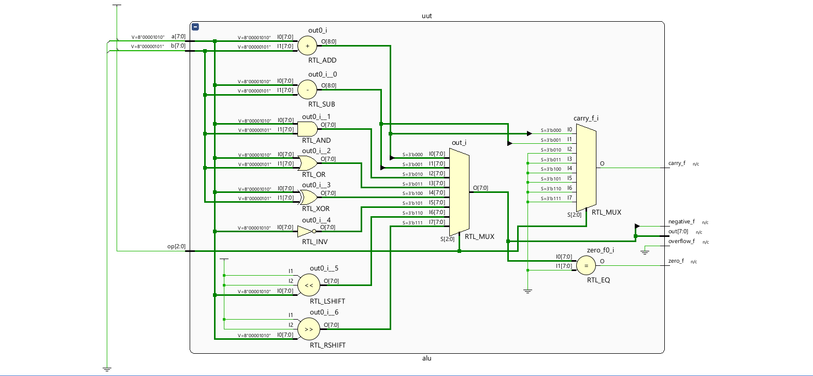
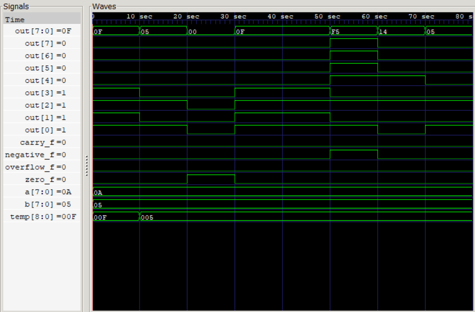

# 8-bit ALU in Verilog

This project implements an **8-bit Arithmetic Logic Unit (ALU)** using Verilog.

## Block Diagram

## Operations Implemented

- ADD
- SUB
- AND
- OR
- XOR
- NOT
- SHIFT LEFT
- SHIFT RIGHT

## Flags Generated

- Zero flag
- Carry flag
- Negative flag
- Overflow flag

## Tools Used

- Verilog
- Icarus Verilog
- GTKWave
- Visual Studio Code
- Vivado

## Simulation Waveform

